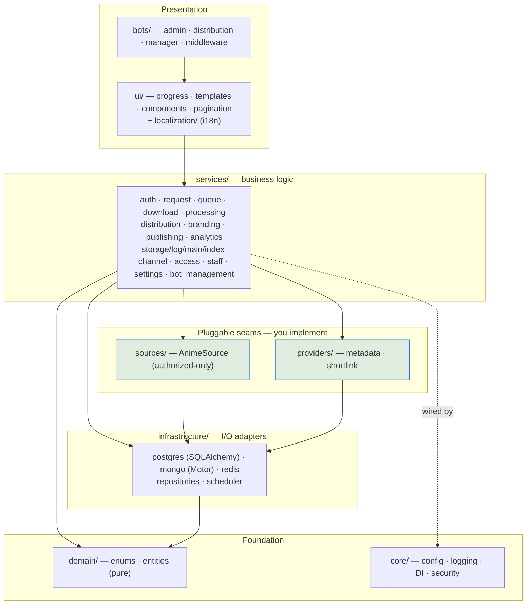
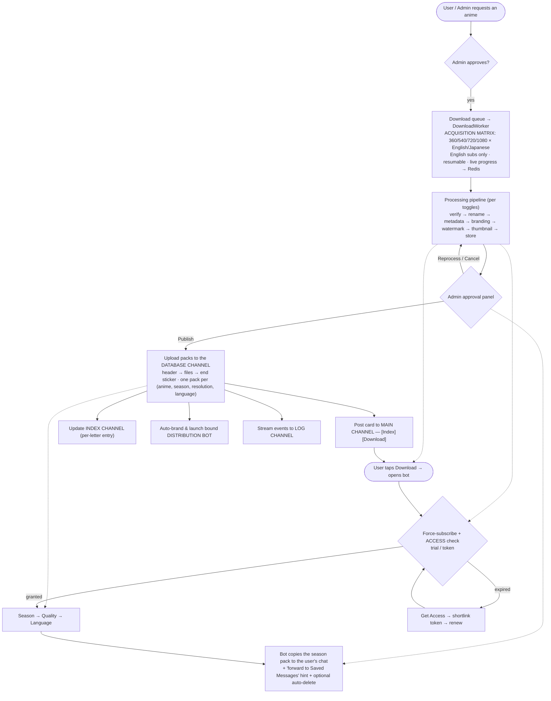

<div align="center">

# ◈ NekoFetch

[](https://github.com/arefin-raian/NekoFetch/actions/workflows/ci.yml)


[](LICENSE)

**A multi-tenant Telegram bot platform for authorized video distribution.**  
Runs dozens of bots in one process — request → acquire → process → approve → publish → deliver.  
Every toggle lives in config or a Telegram admin panel. No code changes needed.

</div>

---

> ## ⚠️ Scope & Legitimacy — read this first
>
> NekoFetch is built **only** for *authorized* distribution. Content enters the system through a pluggable **source interface** (`nekofetch.sources`) with reference implementations for **authorized sources only** — local ingestion of files you own, or HTTP/official APIs you control or are licensed to use. The repository ships **no** plugin that scrapes pirate streaming sites, and the metadata-acquisition layer is a deliberately empty seam you implement yourself against a source you are authorized to use.
>
> **The `kickassanime` source included in this repository is for development/testing only.** Due to budget constraints during development, a free anime source was implemented as a placeholder. This is intended **solely for personal testing** and should be replaced with a properly licensed content source before any production or public deployment. You must implement your own `AnimeSource` subclass for your authorized content library.
>
> **You are solely responsible** for ensuring you hold the rights to any content you ingest or distribute through this software, and for complying with all applicable terms of service.

---

## Table of Contents

1. [What is NekoFetch?](#what-is-nekofetch)
2. [Feature Highlights](#feature-highlights)
3. [Architecture](#architecture)
4. [Technology Stack](#technology-stack)
5. [Project Structure](#project-structure)
6. [End-to-End Data Flow](#end-to-end-data-flow)
7. [The Pluggable Seams](#the-pluggable-seams)
8. [Prerequisites](#prerequisites)
9. [Configuration](#configuration)
   - [Environment Variables (`.env`)](#environment-variables-env)
   - [`config.yaml` — behaviour](#configyaml--behaviour)
   - [Live settings panel](#live-settings-panel)
10. [Quick Start (Docker)](#quick-start-docker)
11. [Deployment Guides](#deployment-guides)
    - [Docker Compose — anywhere with Docker (recommended)](#a-docker-compose--anywhere-with-docker-recommended)
    - [Linux — manual + systemd](#b-linux-manual--systemd)
    - [Windows — native or WSL](#c-windows-native-or-wsl)
    - [Termux / Android](#d-termux--android)
    - [Render (Background Worker)](#e-render-background-worker)
    - [Railway](#f-railway)
    - [Koyeb](#g-koyeb)
    - [Fly.io](#h-flyio)
    - [Managed / external data services (free tiers)](#managed--external-data-services-free-tiers)
12. [Database Migrations](#database-migrations)
13. [Channel Setup](#channel-setup)
14. [Using the Admin Bot](#using-the-admin-bot)
15. [Testing & CI](#testing--ci)
16. [Troubleshooting](#troubleshooting)
17. [Documentation Index](#documentation-index)
18. [Contributing](#contributing)
19. [License & Responsibility](#license--responsibility)

---

## What is NekoFetch?

NekoFetch is a **multi-tenant Telegram bot platform** for distributing video content you are authorized to share. It runs as a single long-lived Python process that boots one admin bot + N distribution bots, a download worker, a processing pipeline, and a scheduler — all on one event loop.

The admin bot is your cockpit:
- Accept requests from users, manage the download queue, approve/reprocess/cancel finished content
- Spawn distribution bots on demand (paste a BotFather token, bind a title, done)
- Toggle every feature live from inside Telegram — no file editing, no restart

Each distribution bot is a standalone searchable library with a premium UX: poster cards → season selection → quality × language chooser → delivery. Everything goes through Telegram's MTProto — no HTTP server, no webhooks, no public port needed.

Beneath the bots sits a full backend:
- **Pluggable source seam** — implement `AnimeSource` for your authorized content library
- **Acquisition matrix** — fans out unresolved requests into every quality × language combo
- **Processing pipeline** — verify → rename → metadata → branding → watermark → thumbnail → store
- **Channel-based storage** — content is stored as ordered Telegram message packs (header → files → end sticker) in a private database channel
- **Time-based access control** — free trial → shortlink token → renew
- **Full notification system** — users get DM alerts on download complete, processing complete, publish, or failure; admin gets Telegram alerts on bot/channel failures
- **Live log channel** — two auto-updated pinned messages (dashboard + catalog), every event tracked in HTML with inline blockquotes
- **Premium UI** — Unicode small-caps typography, bold serif headings, `<blockquote>` wrapping, dot-escalation loading animations, spoiler welcome screens

Everything is togglable at runtime from `config.yaml` or the Telegram settings panel. No code changes to adapt the platform to your workflow.

---

## Feature Highlights

<table>
<tr><td>

**Distribution & UX**
- Multi-bot runtime (run dozens of bots in one process)
- Premium UX kit: Unicode small-caps typography, blockquote HTML, `▰▱` progress bars
- Dot-escalation loading animations on every async operation
- Season-centric **package delivery** (not episode-by-episode)
- Poster → Season → Quality → Language → Deliver
- Spoiler welcome screen with sticker animation
- Force-subscribe gate, auto-delete, protected content

</td><td>

**Content Pipeline**
- Authorized-only **source seam** (local + your APIs)
- Multi-quality × multi-language **acquisition matrix**
- Resumable downloads with live progress (per-episode tracking)
- verify → rename → metadata → branding → watermark → thumbnail → store
- Admin **approval** before anything goes public

</td></tr>
<tr><td>

**Channels & Notifications**
- **Database channel** — content stored as ordered packs (header → files → end sticker)
- **Main channel** — auto-posted cards with [Index] [Download] buttons
- **Index channel** — stylized, auto-maintained per-letter index
- **Log channel** — every event in HTML with blockquotes, 2 auto-updated pinned messages (dashboard + catalog)
- **User notifications** — DM alerts on download complete, processing complete, publish, and failures
- **Admin alerts** — Telegram DMs on bot start failures, channel peer resolution exhaustion

</td><td>

**Platform**
- Configuration-first (`.env` + `config.yaml` + live in-bot overrides)
- Role-based access (user / staff / admin) + audit logs
- **Access/token system** (trial → shortlink → renew)
- Postgres + MongoDB + Redis, Alembic migrations
- Localized text (no hardcoded strings), Docker-ready, tested + CI

</td></tr>
</table>

---

## Architecture

NekoFetch follows **clean architecture**: dependencies point inward. The domain layer is
pure; outer layers depend on inner ones, never the reverse.



**Dependency rule:** `bots/ui → services → repositories/providers/sources → infrastructure`.
`domain` and `core` are imported everywhere but import nothing outward. Concrete adapters are
wired by the **DI container** (`core/container.py`) at startup.

See [`docs/ARCHITECTURE.md`](docs/ARCHITECTURE.md) for the full design.

---

## Technology Stack

| Concern              | Choice                                               |
|----------------------|------------------------------------------------------|
| Language             | **Python 3.12+**, async-first                        |
| Telegram             | **Pyrogram** (MTProto — large media + many bots)     |
| Relational DB        | **PostgreSQL** via SQLAlchemy 2.0 async + `asyncpg`  |
| Migrations           | **Alembic**                                          |
| Document DB          | **MongoDB** via Motor (metadata, templates, settings)|
| Cache / queues / FSM | **Redis** (`redis.asyncio`)                          |
| Scheduling           | **APScheduler** (link expiry, auto-delete, refresh)  |
| Config               | **Pydantic v2** settings (`.env`) + `config.yaml`    |
| Logging              | **structlog** (console or JSON)                      |
| Media tooling        | **ffmpeg** + **mkvtoolnix** (metadata/thumb/watermark)|
| Crypto               | **cryptography** (Fernet bot-token encryption)       |
| Packaging / deploy   | **Docker** + **Docker Compose**                      |
| Quality              | **pytest** + **ruff** + GitHub Actions CI            |

---

## Project Structure

```
NekoFetch/
├── src/nekofetch/
│   ├── __main__.py                  # entry point: boots container + bot manager
│   │
│   ├── core/                        # foundation — imports nothing outward
│   │   ├── config.py                #   3-layer config (env + yaml) — every section model
│   │   ├── container.py             #   DI composition root (DB clients, providers, cipher)
│   │   ├── security.py              #   Fernet cipher for bot-token encryption
│   │   ├── logging.py               #   structlog setup       · constants.py · exceptions.py
│   │   └── parsing.py               #   pure helpers (episode-spec parser, …)
│   │
│   ├── domain/
│   │   └── enums.py                 # Role, Permission, RequestStatus, JobStatus, AudioType, …
│   │
│   ├── infrastructure/              # I/O adapters
│   │   ├── database/
│   │   │   ├── postgres/            #   base.py · models.py (ORM) · session.py
│   │   │   ├── mongo/collections.py #   Motor collections + indexes
│   │   │   └── redis/progress.py    #   live progress store
│   │   ├── repositories/            #   base · user · request · queue (repository pattern)
│   │   └── scheduler.py             #   APScheduler wrapper (expiry, auto-delete, refresh)
│   │
│   ├── sources/                     # ← SEAM: authorized content acquisition
│   │   ├── base.py                  #   AnimeSource ABC (search/details/episodes/variants/download)
│   │   ├── local.py                 #   LocalFileSource reference (files you own)
│   │   └── registry.py
│   │
│   ├── providers/
│   │   ├── metadata/                # ← SEAM: rich info cards
│   │   │   ├── scraper.py           #   ★ implement this ONE file (fetch_* + implemented=True)
│   │   │   ├── models.py · base.py · transformer.py · renderer.py · registry.py
│   │   └── shortlink/               # ← SEAM: token-gating shortener
│   │       ├── base.py · registry.py
│   │       └── linkvertise.py       #   built-in Linkvertise adapter
│   │
│   ├── services/                    # business logic
│   │   ├── auth_service.py          #   roles + permission checks
│   │   ├── request_service.py       #   public request workflow
│   │   ├── queue_service.py         #   download queue + dashboard
│   │   ├── download_service.py      #   resumable worker + acquisition matrix
│   │   ├── processing/              #   pipeline: base · pipeline · stages
│   │   ├── publishing_service.py    #   approval → publish → upload packs → post
│   │   ├── distribution_service.py  #   season packages + temporary links
│   │   ├── storage_channel_service.py  # database channel: index / upload / deliver
│   │   ├── main_channel_service.py  #   main-channel posts ([Index][Download])
│   │   ├── index_channel_service.py #   per-letter index posts
│   │   ├── log_channel_service.py   #   event sink + pinned dashboard/catalog
│   │   ├── access_service.py        #   trial + shortlink-token gating
│   │   ├── bot_management_service.py · bot_branding.py   # spawn / bind / auto-brand bots
│   │   ├── enrichment_service.py    #   metadata cache + render cards
│   │   ├── branding_service.py · settings_service.py · staff_service.py · analytics_service.py
│   │
│   ├── ui/                          # progress.py · templates.py · components.py (pagination)
│   ├── localization/i18n.py         # loads resources/language/*.json
│   │
│   └── bots/                        # Telegram layer (Pyrogram)
│       ├── manager.py               #   multi-bot runtime + download worker + scheduler
│       ├── middleware.py            #   auth / rate-limit / anti-spam
│       ├── force_sub.py · fsm.py    #   force-subscribe gate · Redis FSM
│       ├── admin/
│       │   ├── app.py · keyboards.py
│       │   └── handlers/            #   start · requests · settings · approvals · bots_admin
│       │                            #   storage_admin · staff_admin · admin_tools (broadcast)
│       └── distribution/app.py      #   public anime-bot interface (+ access gate, deep links)
│
├── migrations/                      # Alembic: env.py · script.py.mako · versions/0001_initial
├── resources/language/en.json       # all user-facing text (edit freely, no code changes)
├── tests/                           # pytest suite (parsing, progress, templates, perms, …)
├── docs/                            # ARCHITECTURE · DEPLOYMENT · SCRAPER_GUIDE · JOURNAL · TASKS
├── config.yaml                      # feature toggles & behaviour (20+ sections)
├── .env.example                     # secrets & connection strings
├── alembic.ini · pyproject.toml     # migrations config · packaging + tooling
├── Dockerfile · docker-compose.yml  # postgres + mongo + redis + nekofetch
├── .github/workflows/ci.yml         # ruff + compile + pytest
└── LICENSE · CHANGELOG.md · .recovery-state.json
```

> `★` marks the single file to implement for metadata scraping; `←` marks the three
> pluggable seams. Everything else works out of the box.

---

## End-to-End Data Flow

This is the full lifecycle of a title, from request to a user's chat:



Every step is independently toggleable and configurable.

---

## The Pluggable Seams

NekoFetch keeps the parts you must own to **single, well-documented files**:

| Seam | File to edit | Purpose |
|------|--------------|---------|
| **Content source** | `src/nekofetch/sources/` (implement `AnimeSource`) | Where episodes come from. `LocalFileSource` ships as a reference (files you own). |
| **Metadata scraper** | `src/nekofetch/providers/metadata/scraper.py` | Rich info cards (synopsis, genres, characters, artwork). Implement four `fetch_*` methods, flip `implemented = True`. See [`docs/SCRAPER_GUIDE.md`](docs/SCRAPER_GUIDE.md). |
| **URL shortener** | `src/nekofetch/providers/shortlink/` | Token-gating shortener. A **Linkvertise** adapter is included; add others in one file. |

Until you implement them, the rest of the system runs and **degrades gracefully** (basic
metadata, direct links). Implement, and every consumer upgrades automatically — **no other
file changes**.

---

## Prerequisites

You will need:

1. **Telegram API credentials** — create an app at <https://my.telegram.org> → `api_id` + `api_hash`.
2. **An Admin bot token** — from [@BotFather](https://t.me/BotFather).
3. **Your Telegram user id** — from [@userinfobot](https://t.me/userinfobot).
4. **PostgreSQL, MongoDB, Redis** — local, Docker, or managed (see [external services](#managed--external-data-services-free-tiers)).
5. **ffmpeg + mkvtoolnix** — for metadata/thumbnail/watermark stages (bundled in the Docker image).

---

## Configuration

NekoFetch has **three configuration layers**, in increasing precedence:

```
.env  (secrets)   →   config.yaml  (behaviour)   →   in-bot Settings panel  (live overrides, stored in Mongo)
```

### Environment Variables (`.env`)

```bash
cp .env.example .env
# then edit .env with your values
```

| Variable | Required | Default | Description |
|---|---|---|---|
| `TELEGRAM_API_ID` | **Yes** | — | From [my.telegram.org](https://my.telegram.org) — create an app |
| `TELEGRAM_API_HASH` | **Yes** | — | From my.telegram.org |
| `ADMIN_BOT_TOKEN` | **Yes** | — | BotFather token for the management bot |
| `ADMIN_IDS` | **Yes** | — | Comma-separated Telegram user IDs with full admin access |
| `SECRET_KEY` | **Yes** | — | Fernet key — run: `python -c "from cryptography.fernet import Fernet; print(Fernet.generate_key().decode())"` |
| `POSTGRES_HOST` | No | `postgres` | PostgreSQL host |
| `POSTGRES_PORT` | No | `5432` | PostgreSQL port |
| `POSTGRES_USER` | No | `nekofetch` | PostgreSQL user |
| `POSTGRES_PASSWORD` | No | `change-me` | PostgreSQL password |
| `POSTGRES_DB` | No | `nekofetch` | PostgreSQL database name |
| `MONGO_URI` | No | `mongodb://mongo:27017` | MongoDB connection string |
| `MONGO_DB` | No | `nekofetch` | MongoDB database name |
| `REDIS_URL` | No | `redis://redis:6379/0` | Redis connection string |
| `STORAGE_PATH` | No | `/data/storage` | Directory for downloaded media files |
| `SESSION_PATH` | No | `/data/sessions` | Directory for Pyrogram `.session` files |
| `LOG_LEVEL` | No | `INFO` | One of `DEBUG`, `INFO`, `WARNING`, `ERROR` |
| `LOG_JSON` | No | `false` | Set `true` for JSON log output (production) |
| `AUTO_CREATE_SCHEMA` | No | `true` | `true` = auto-create tables on startup (dev); `false` = use Alembic migrations (prod) |

Only the 5 **Yes** variables are strictly required. Everything else has sensible defaults for the Docker Compose stack and only needs changing when pointing at external/managed databases or custom paths.

### `config.yaml` — behaviour

Every major subsystem is a section you can tune or disable:

| Section | Controls |
|---|---|
| `features` | Master on/off switches for whole subsystems |
| `downloads` | Concurrency, retries, resume, progress interval |
| `acquisition` | Quality × language matrix + English-subs enforcement |
| `processing` / `rename` / `metadata` / `thumbnail` / `watermark` | Pipeline stages, each independently toggleable |
| `branding` | Channel name, footer text, watermark text, metadata author |
| `distribution` | Season packages, protected content, temporary links, auto-delete |
| `storage_channel` | Database channel config (header template, end sticker, copy mode) |
| `log_channel` | Event routing + pinned dashboard/catalog |
| `main_channel` / `index_channel` | Public post caption template + index styling |
| `access` / `shortlink` | Trial duration, token lifetime, Linkvertise provider config |
| `security` | Rate limiting, anti-spam cooldown, force-subscribe, owner id |
| `ui` | Start sticker ID, welcome image, loading animation delays |
| `sources` | Authorized source enable/disable |

Channel-dependent features (`storage_channel`, `log_channel`, `main_channel`, `index_channel`, `access`, `shortlink`) ship **disabled** — turn them on once the channels are set up.

### Live settings panel

Admins can flip feature toggles and edit branding **from inside Telegram** (Admin Panel → Settings). Changes apply immediately and persist to MongoDB without a restart.

---

## Quick Start (Docker Compose)

The fastest path — works on **Linux, Windows (Docker Desktop), macOS**, and any VPS:

```bash
git clone https://github.com/arefin-raian/NekoFetch.git
cd NekoFetch
cp .env.example .env
```

Edit `.env` — you need **5 values**:
- `TELEGRAM_API_ID` + `TELEGRAM_API_HASH` from [my.telegram.org](https://my.telegram.org)
- `ADMIN_BOT_TOKEN` from [@BotFather](https://t.me/BotFather)
- `ADMIN_IDS` — your Telegram user ID (get it from [@userinfobot](https://t.me/userinfobot))
- `SECRET_KEY` — generate: `python -c "from cryptography.fernet import Fernet; print(Fernet.generate_key().decode())"`

```bash
docker compose up -d
docker compose logs -f nekofetch
```

When you see `bots.admin.started`, open your admin bot and send `/start`.  
That's it. Everything — Postgres, Mongo, Redis, the app — is running.

```
# Update later:
git pull && docker compose build && docker compose up -d
```

> **No Docker?** If your platform doesn't support Docker (e.g. Termux, some free tiers), use managed databases and run the app natively — see the platform-specific guides below.

---

## Deployment Guides

NekoFetch is a **long-lived worker process** (`python -m nekofetch`) — it does **not** expose an HTTP port. On platforms whose free tier requires a bound port, run as a **Background Worker** or add a minimal health endpoint.

### A. Docker Compose — anywhere with Docker (recommended)

Works identically on:
- **Linux** (Ubuntu, Debian, Arch, etc.)
- **Windows** (Docker Desktop + WSL2 backend)
- **macOS** (Docker Desktop)
- **Any VPS** with Docker installed

Steps are the [Quick Start](#quick-start-docker-compose) above. Named volumes persist data across restarts. For a VPS:

```bash
# First time
apt install docker docker-compose-plugin
git clone https://github.com/arefin-raian/NekoFetch.git && cd NekoFetch
# edit .env, then:
docker compose up -d

# Updates
git pull && docker compose build && docker compose up -d
```

### B. Linux — manual + systemd

For bare-metal Linux without Docker:

```bash
# 1. System deps (Debian/Ubuntu)
sudo apt update && sudo apt install -y python3.12 python3.12-venv ffmpeg mkvtoolnix \
    postgresql redis-server
# MongoDB: install from the official MongoDB apt repo, or use Atlas (free tier)

# 2. App setup
git clone https://github.com/arefin-raian/NekoFetch.git && cd NekoFetch
python3.12 -m venv .venv && source .venv/bin/activate
pip install -e ".[dev]"
cp .env.example .env   # edit with your secrets

# 3. Run (foreground)
python -m nekofetch
```

**Systemd service** — `/etc/systemd/system/nekofetch.service`:

```ini
[Unit]
Description=NekoFetch
After=network.target postgresql.service redis-server.service

[Service]
WorkingDirectory=/opt/NekoFetch
ExecStart=/opt/NekoFetch/.venv/bin/python -m nekofetch
EnvironmentFile=/opt/NekoFetch/.env
Restart=always
User=nekofetch

[Install]
WantedBy=multi-user.target
```

```bash
sudo systemctl daemon-reload && sudo systemctl enable --now nekofetch
journalctl -u nekofetch -f
```

### C. Windows — native or WSL

**Option 1 — Native Python (simpler):**

```powershell
# Install Python 3.12 from python.org, ffmpeg from gyan.dev or `winget install ffmpeg`
git clone https://github.com/arefin-raian/NekoFetch.git
cd NekoFetch
py -3.12 -m venv .venv
.venv\Scripts\activate
pip install -e ".[dev]"
copy .env.example .env   # edit with Notepad
python -m nekofetch
```

For databases on Windows, the easiest path is **Docker Desktop** just for the DBs:
```powershell
docker compose up -d postgres mongo redis
python -m nekofetch
```

Or use **managed/external services** (Neon + Atlas + Upstash) and skip Docker entirely.  
To run as a background service, wrap with [NSSM](https://nssm.cc/).

**Option 2 — WSL2 + Docker (recommended for Windows):**  
Follow the Docker Compose guide inside an Ubuntu WSL2 terminal. Docker Desktop on Windows handles the VM, and all commands are identical to the Linux guide.

### D. Termux / Android

> MongoDB has no native Android build. Run the app on Termux with cloud-hosted databases.

```bash
pkg update && pkg upgrade
pkg install python git ffmpeg rust binutils
git clone https://github.com/arefin-raian/NekoFetch.git && cd NekoFetch
pip install -e .
cp .env.example .env
```

Edit `.env` to point at managed databases (see [external services](#managed--external-data-services-free-tiers)). Set `AUTO_CREATE_SCHEMA=true`.

```bash
python -m nekofetch
```

Keep alive with `termux-wake-lock`; run inside `tmux` so it survives the app closing.

```bash
pkg install tmux
tmux new -s nekofetch
python -m nekofetch
# Ctrl+B, D to detach. `tmux attach -t nekofetch` to reattach.
```

### E. Render (Background Worker)

Render offers managed PostgreSQL + Redis (Key Value). Use MongoDB Atlas for Mongo.

1. Create a **PostgreSQL** instance and a **Key Value** instance on Render.
2. Create a free **MongoDB Atlas** M0 cluster.
3. **New → Background Worker** → connect your GitHub repo.
   - **Runtime:** Docker (uses the included `Dockerfile`)
   - Or **Native Python:** Build = `pip install -e .`, Start = `python -m nekofetch`
4. Add all env vars from `.env`, pointing `POSTGRES_*` at your Render PG, `MONGO_URI` at Atlas, `REDIS_URL` at Render Key Value.
5. Set `AUTO_CREATE_SCHEMA=true` for the first deploy.
6. Attach a **persistent disk** mounted at `/data` for Pyrogram sessions and media storage.

> Render's free tier is web-services-only; Background Workers require a paid plan. For a free deploy, add a lightweight health endpoint or use Railway's free tier instead.

### F. Railway

Railway has first-class PostgreSQL, Redis, and MongoDB plugins.

1. **New Project → Deploy from GitHub repo** → select NekoFetch.
2. **+ New → Database** three times: PostgreSQL, Redis, MongoDB.
3. In the NekoFetch service **Variables** tab, add:
   - All Telegram secrets (`TELEGRAM_API_ID`, `TELEGRAM_API_HASH`, `ADMIN_BOT_TOKEN`, `ADMIN_IDS`, `SECRET_KEY`)
   - Railway auto-injects `PGHOST`, `REDIS_URL`, `MONGO_URL` — map them:
     - `POSTGRES_HOST` = `${{ Railway PG Host }}`
     - `MONGO_URI` = `${{ Railway Mongo URI }}`
     - `REDIS_URL` = `${{ Railway Redis URL }}`
4. **Start command:** `python -m nekofetch`
5. Attach a **Volume** at `/data` for sessions + media.

### G. Koyeb

1. Create a managed Postgres on Koyeb.
2. Use **Atlas** (MongoDB free tier) + **Upstash** (Redis free tier).
3. **Create Service → GitHub → NekoFetch**, builder = Docker.
4. Set service type to **Worker** (no port mapping required).
5. Add all env vars, attach a persistent volume at `/data`.

### H. Fly.io

```bash
fly launch --no-deploy
# Remove [http_service] and [[services]] from fly.toml — no HTTP port needed
fly postgres create
fly ext redis create   # Upstash Redis
# Create free Atlas M0 cluster for Mongo
fly secrets set TELEGRAM_API_ID=… TELEGRAM_API_HASH=… ADMIN_BOT_TOKEN=… ADMIN_IDS=… SECRET_KEY=… \
               MONGO_URI=… REDIS_URL=… POSTGRES_HOST=… POSTGRES_PASSWORD=…
fly volumes create nekodata --size 3   # mount at /data in fly.toml
fly deploy
```

### Managed / external data services (free tiers)

Mix and match any combination — point `.env` at these:

| Service | Free option | Notes |
|---|---|---|
| **PostgreSQL** | [Neon](https://neon.tech), [Supabase](https://supabase.com), Railway, Render | All offer durable Postgres with connection pooling |
| **MongoDB** | [MongoDB Atlas](https://www.mongodb.com/atlas) (M0 free tier) | 512 MB, enough for metadata + settings |
| **Redis** | [Upstash](https://upstash.com), Railway, Render Key Value | Serverless Redis with free tier; set `REDIS_URL` |

---

## Database Migrations

For the first run, `AUTO_CREATE_SCHEMA=true` creates the tables automatically. For
production, set it `false` and use **Alembic**:

```bash
alembic upgrade head                                   # apply schema
alembic revision --autogenerate -m "describe change"   # after editing models
alembic upgrade head
# inside Docker:
docker compose exec nekofetch alembic upgrade head
```

---

## Channel Setup

NekoFetch can use up to four Telegram channels. **Add your admin bot as an administrator of
each**, set its id in `config.yaml`, and enable it. Full walkthrough in
[`docs/DEPLOYMENT.md`](docs/DEPLOYMENT.md).

| Channel | Role |
|---|---|
| **Database** (`storage_channel`) | content lives here as packs (`header → files → end sticker`) |
| **Main** (`main_channel`) | public posts: poster + caption + `[Index] [Download]` |
| **Index** (`index_channel`) | stylized per-letter index the bot maintains |
| **Log** (`log_channel`) | every event + pinned dashboard + pinned catalog |

---

## Using the Admin Bot

Send `/start` to your admin bot → **Admin Panel**:

- **Queue** — live download dashboard with per-episode progress, speed, ETA (HTML blockquote rendering, auto-refreshed)
- **Approvals** — Publish / Reprocess / Cancel finished content with full file summaries
- **Bots** — paste a BotFather token to spawn a distribution bot; bind a title; see titles awaiting a bot
- **Storage** — assisted pack indexing (`anime_ref | season | resolution | language | start_id | end_id`)
- **Settings** — live feature toggles (persisted to Mongo, apply instantly without restart)
- **Analytics** — users, downloads, queue size, most requested titles
- **Staff** — promote/demote, ban/unban with role-based permissions
- **Broadcast** — message all users

Every UI element uses Unicode small-caps typography, bold serif headings, and HTML blockquote wrapping. Async operations show a dot-escalation loading animation. Errors and success states are wrapped in expandable blockquotes with clear emoji indicators.

**User experience:**

- **Request flow** — Request Anime → search → pick → season → scope → submit → track in queue
- **Notifications** — users receive Telegram DMs when their download completes, processing finishes, content is published, or when a failure occurs (with error details)
- **Admin alerts** — if a distribution bot fails to start or a channel peer can't be resolved, the owner gets a Telegram DM

**Distribution bot UX:**

- Poster card with spoiler image on `/start`
- Animated sticker intro (deleted after 1.5s)
- Season → Resolution → Language → Delivery
- Temporary links with configurable expiry
- Auto-delete after delivery (optional)
- Force-subscribe gate (optional)

---

## Testing & CI

```bash
pip install -e ".[dev]"
ruff check src tests        # lint
python -m compileall src     # syntax
pytest -q                    # unit tests
```

GitHub Actions ([`.github/workflows/ci.yml`](.github/workflows/ci.yml)) runs ruff + compile +
pytest on every push and PR.

---

## Troubleshooting

| Symptom | Likely cause |
|---|---|
| Bot doesn't respond to `/start` | Wrong `ADMIN_BOT_TOKEN`, or DBs unreachable (check logs) |
| No **Admin Panel** button | Your ID isn't in `ADMIN_IDS` |
| Log/main/index channel silent | Bot isn't a channel **admin**, or wrong `channel_id` (`-100…`). The bot must also have received at least one message in a private channel to cache its `access_hash` |
| Log channel pins missing after channel change | Old pins are automatically cleaned up when `channel_id` changes, but the bot needs to be admin of the old channel to delete them |
| Indexing / delivery fails | Bot not an admin of the storage channel, or bad message range |
| Metadata cards missing | `providers/metadata/scraper.py` still has `implemented = False` (expected for a fresh clone) |
| Distribution bot won't start | Token is invalid (regenerate with BotFather), or the bot is already running elsewhere |
| Access link does nothing | `shortlink.linkvertise_user_id` not set, or `access.enabled = false` |
| Users not getting notifications | The admin bot must have **started a conversation** with the user (user must send `/start` to the admin bot at least once) |
| Rate limit message shows raw text | The `middleware.py` now uses HTML + `bq()` — if you see raw `<blockquote>` in the message, your Pyrogram version is too old (upgrade to 2.x) |
| Loading animation not showing | The message edit for loading happens asynchronously — if the follow-up operation completes instantly, the edit may be overwritten before it's visible. Normal behavior for fast operations |
| Sticker not deleted on `/start` | The `sticker_delete_delay` in `config.yaml` is too short, or the bot lacks delete permission in the DM |
| Build fails on a PaaS | Install `ffmpeg`; ensure Rust toolchain for some wheels (Termux) |
| `Microsoft Visual C++ 14.0 … is required` (Windows) | Only the optional `tgcrypto` speedup needs a compiler — it's **not** required. A plain `pip install -e .` skips it; the bot runs on pure-Python crypto |

---

## Documentation Index

| Doc | What's inside |
|---|---|
| [`docs/DEPLOYMENT.md`](docs/DEPLOYMENT.md) | step-by-step first-run + every channel & the access system |
| [`docs/ARCHITECTURE.md`](docs/ARCHITECTURE.md) | design decisions, DB schema, services, pipeline |
| [`docs/SCRAPER_GUIDE.md`](docs/SCRAPER_GUIDE.md) | implement the metadata scraper in one file |
| [`docs/PROJECT_JOURNAL.md`](docs/PROJECT_JOURNAL.md) | chronological development log |
| [`docs/TASKS.md`](docs/TASKS.md) | live task tracker |
| [`CHANGELOG.md`](CHANGELOG.md) | version history |

---

## Contributing

- **Conventional Commits** (`feat:`, `fix:`, `docs:`, `chore:`, `test:`, `refactor:`).
- Keep the dependency rule intact (inner layers never import outer ones).
- Run `ruff` + `pytest` before pushing.
- Update the relevant `docs/` when you change behaviour.

---

## License & Responsibility

Licensed under the **[MIT License](LICENSE)**. NekoFetch is provided **as-is**, with **no
warranty**. It is a neutral distribution platform: it ships no content, no pirate-site
scrapers, and no metadata source — those are seams **you** implement. The `LICENSE` file also
carries an **Acceptable Use Notice**.

**You are solely responsible** for the legality of the content you ingest and distribute, and
for complying with the terms of any source, API, or service you connect. Use it only with
content you own or are licensed to distribute.

<div align="center">

*Built with a configuration-first, recoverable, documented-as-you-go philosophy.*

</div>
