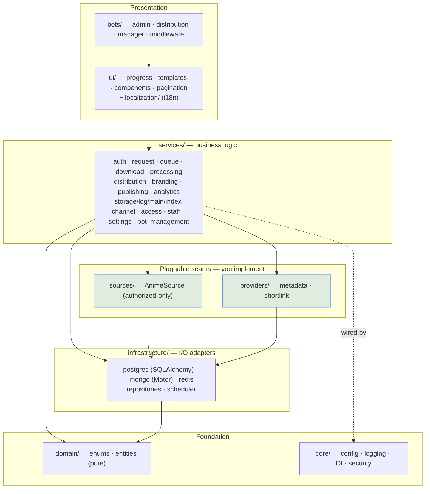
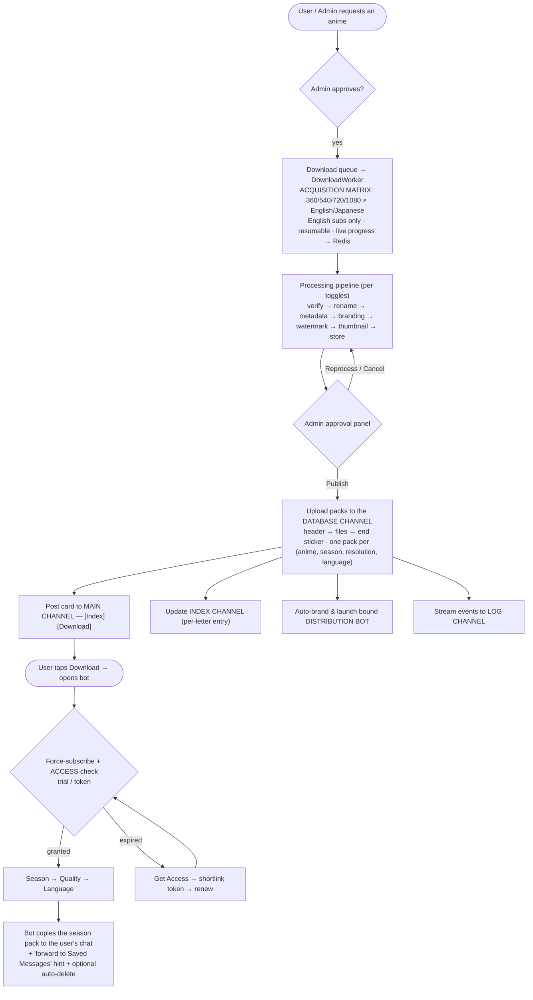

<div align="center">

# ◈ NekoFetch

**A premium, configuration-driven Telegram distribution platform for video content you own or are licensed to distribute.**

[](https://github.com/arefin-raian/NekoFetch/actions/workflows/ci.yml)


[](LICENSE)

</div>

---

> ## ⚠️ Scope & Legitimacy — read this first
>
> NekoFetch is built **only** for *authorized* distribution. Content enters the system
> through a pluggable **source interface** (`nekofetch.sources`) with reference
> implementations for **authorized sources only** — local ingestion of files you own, or
> HTTP/official APIs you control or are licensed to use. The repository ships **no** plugin
> that scrapes pirate streaming sites, and the metadata-acquisition layer is a deliberately
> empty seam you implement yourself against a source you are authorized to use.
>
> **The `kickassanime` source included in this repository is for development/testing only.**
> Due to budget constraints during development, a free anime source was implemented as a
> placeholder. This is intended **solely for personal testing** and should be replaced with
> a properly licensed content source before any production or public deployment. You must
> implement your own `AnimeSource` subclass for your authorized content library.
>
> **You are solely responsible** for ensuring you hold the rights to any content you ingest
> or distribute through this software, and for complying with all applicable terms of service.

---

## Table of Contents

1. [What is NekoFetch?](#what-is-nekofetch)
2. [Feature Highlights](#feature-highlights)
3. [Architecture](#architecture)
4. [Technology Stack](#technology-stack)
5. [Project Structure](#project-structure)
6. [End-to-End Data Flow](#end-to-end-data-flow)
7. [The Pluggable Seams](#the-pluggable-seams)
8. [Prerequisites](#prerequisites)
9. [Configuration](#configuration)
10. [Quick Start (Docker)](#quick-start-docker)
11. [Deployment Guides](#deployment-guides)
    - [Docker Compose (VPS / local)](#a-docker-compose--vps--local--recommended)
    - [Linux (manual + systemd)](#b-linux-manual--systemd)
    - [Windows](#c-windows)
    - [Termux / Android](#d-termux--android)
    - [Render](#e-render)
    - [Railway](#f-railway)
    - [Koyeb](#g-koyeb)
    - [Fly.io](#h-flyio)
    - [Managed / external services](#managed--external-data-services-free-tiers)
12. [Database Migrations](#database-migrations)
13. [Channel Setup](#channel-setup)
14. [Using the Admin Bot](#using-the-admin-bot)
15. [Testing & CI](#testing--ci)
16. [Troubleshooting](#troubleshooting)
17. [Documentation Index](#documentation-index)
18. [Contributing](#contributing)
19. [License & Responsibility](#license--responsibility)

---

## What is NekoFetch?

NekoFetch is a **multi-tenant Telegram bot ecosystem**. It consists of:

- **One private Admin bot** — your management cockpit: request queue, download dashboard,
  processing pipeline, content approval/publishing, analytics, staff management, broadcast,
  and a full in-Telegram settings panel.
- **Any number of public Distribution bots** — generated on demand from a BotFather token,
  each a searchable content library with a premium UX (poster → season → quality → language
  → delivery).

Around those bots sits a complete backend: an **acquisition layer** (authorized sources),
a **processing pipeline** (verify → rename → metadata → branding → watermark → thumbnail →
store), **channel-based storage & delivery**, **time-based access control**, and a
**configuration-first** design where almost everything is toggleable at runtime — from a
file or from inside Telegram, without touching code.

It is designed to feel **closer to a premium SaaS platform than a typical Telegram bot**:
animated progress, live message-edit dashboards, inline pagination, elegant typography, and
minimal emoji.

---

## Feature Highlights

<table>
<tr><td>

**Distribution & UX**
- Multi-bot runtime (run dozens of bots in one process)
- Premium UX kit: `▰▱` progress bars, paginated menus, live dashboards
- Season-centric **package delivery** (not episode-by-episode)
- Poster → Season → Quality → Language → Deliver
- Force-subscribe gate, auto-delete, protected content

</td><td>

**Content Pipeline**
- Authorized-only **source seam** (local + your APIs)
- Multi-quality × multi-language **acquisition matrix**
- Resumable downloads with live progress
- verify → rename → metadata → branding → watermark → thumbnail → store
- Admin **approval** before anything goes public

</td></tr>
<tr><td>

**Channels**
- **Database channel** — content stored as ordered packs (`header → files → end sticker`)
- **Main channel** — auto-posted cards with `[Index] [Download]`
- **Index channel** — stylized, auto-maintained per-letter index
- **Log channel** — every event + 2 auto-updated pinned messages

</td><td>

**Platform**
- Configuration-first (`.env` + `config.yaml` + live in-bot overrides)
- Role-based access (user / staff / admin) + audit logs
- **Access/token system** (trial → shortlink → renew)
- Postgres + MongoDB + Redis, Alembic migrations
- Localized text (no hardcoded strings), Docker-ready, tested + CI

</td></tr>
</table>

---

## Architecture

NekoFetch follows **clean architecture**: dependencies point inward. The domain layer is
pure; outer layers depend on inner ones, never the reverse.



**Dependency rule:** `bots/ui → services → repositories/providers/sources → infrastructure`.
`domain` and `core` are imported everywhere but import nothing outward. Concrete adapters are
wired by the **DI container** (`core/container.py`) at startup.

See [`docs/ARCHITECTURE.md`](docs/ARCHITECTURE.md) for the full design.

---

## Technology Stack

| Concern              | Choice                                               |
|----------------------|------------------------------------------------------|
| Language             | **Python 3.12+**, async-first                        |
| Telegram             | **Pyrogram** (MTProto — large media + many bots)     |
| Relational DB        | **PostgreSQL** via SQLAlchemy 2.0 async + `asyncpg`  |
| Migrations           | **Alembic**                                          |
| Document DB          | **MongoDB** via Motor (metadata, templates, settings)|
| Cache / queues / FSM | **Redis** (`redis.asyncio`)                          |
| Scheduling           | **APScheduler** (link expiry, auto-delete, refresh)  |
| Config               | **Pydantic v2** settings (`.env`) + `config.yaml`    |
| Logging              | **structlog** (console or JSON)                      |
| Media tooling        | **ffmpeg** + **mkvtoolnix** (metadata/thumb/watermark)|
| Crypto               | **cryptography** (Fernet bot-token encryption)       |
| Packaging / deploy   | **Docker** + **Docker Compose**                      |
| Quality              | **pytest** + **ruff** + GitHub Actions CI            |

---

## Project Structure

```
NekoFetch/
├── src/nekofetch/
│   ├── __main__.py                  # entry point: boots container + bot manager
│   │
│   ├── core/                        # foundation — imports nothing outward
│   │   ├── config.py                #   3-layer config (env + yaml) — every section model
│   │   ├── container.py             #   DI composition root (DB clients, providers, cipher)
│   │   ├── security.py              #   Fernet cipher for bot-token encryption
│   │   ├── logging.py               #   structlog setup       · constants.py · exceptions.py
│   │   └── parsing.py               #   pure helpers (episode-spec parser, …)
│   │
│   ├── domain/
│   │   └── enums.py                 # Role, Permission, RequestStatus, JobStatus, AudioType, …
│   │
│   ├── infrastructure/              # I/O adapters
│   │   ├── database/
│   │   │   ├── postgres/            #   base.py · models.py (ORM) · session.py
│   │   │   ├── mongo/collections.py #   Motor collections + indexes
│   │   │   └── redis/progress.py    #   live progress store
│   │   ├── repositories/            #   base · user · request · queue (repository pattern)
│   │   └── scheduler.py             #   APScheduler wrapper (expiry, auto-delete, refresh)
│   │
│   ├── sources/                     # ← SEAM: authorized content acquisition
│   │   ├── base.py                  #   AnimeSource ABC (search/details/episodes/variants/download)
│   │   ├── local.py                 #   LocalFileSource reference (files you own)
│   │   └── registry.py
│   │
│   ├── providers/
│   │   ├── metadata/                # ← SEAM: rich info cards
│   │   │   ├── scraper.py           #   ★ implement this ONE file (fetch_* + implemented=True)
│   │   │   ├── models.py · base.py · transformer.py · renderer.py · registry.py
│   │   └── shortlink/               # ← SEAM: token-gating shortener
│   │       ├── base.py · registry.py
│   │       └── linkvertise.py       #   built-in Linkvertise adapter
│   │
│   ├── services/                    # business logic
│   │   ├── auth_service.py          #   roles + permission checks
│   │   ├── request_service.py       #   public request workflow
│   │   ├── queue_service.py         #   download queue + dashboard
│   │   ├── download_service.py      #   resumable worker + acquisition matrix
│   │   ├── processing/              #   pipeline: base · pipeline · stages
│   │   ├── publishing_service.py    #   approval → publish → upload packs → post
│   │   ├── distribution_service.py  #   season packages + temporary links
│   │   ├── storage_channel_service.py  # database channel: index / upload / deliver
│   │   ├── main_channel_service.py  #   main-channel posts ([Index][Download])
│   │   ├── index_channel_service.py #   per-letter index posts
│   │   ├── log_channel_service.py   #   event sink + pinned dashboard/catalog
│   │   ├── access_service.py        #   trial + shortlink-token gating
│   │   ├── bot_management_service.py · bot_branding.py   # spawn / bind / auto-brand bots
│   │   ├── enrichment_service.py    #   metadata cache + render cards
│   │   ├── branding_service.py · settings_service.py · staff_service.py · analytics_service.py
│   │
│   ├── ui/                          # progress.py · templates.py · components.py (pagination)
│   ├── localization/i18n.py         # loads resources/language/*.json
│   │
│   └── bots/                        # Telegram layer (Pyrogram)
│       ├── manager.py               #   multi-bot runtime + download worker + scheduler
│       ├── middleware.py            #   auth / rate-limit / anti-spam
│       ├── force_sub.py · fsm.py    #   force-subscribe gate · Redis FSM
│       ├── admin/
│       │   ├── app.py · keyboards.py
│       │   └── handlers/            #   start · requests · settings · approvals · bots_admin
│       │                            #   storage_admin · staff_admin · admin_tools (broadcast)
│       └── distribution/app.py      #   public anime-bot interface (+ access gate, deep links)
│
├── migrations/                      # Alembic: env.py · script.py.mako · versions/0001_initial
├── resources/language/en.json       # all user-facing text (edit freely, no code changes)
├── tests/                           # pytest suite (parsing, progress, templates, perms, …)
├── docs/                            # ARCHITECTURE · DEPLOYMENT · SCRAPER_GUIDE · JOURNAL · TASKS
├── config.yaml                      # feature toggles & behaviour (20+ sections)
├── .env.example                     # secrets & connection strings
├── alembic.ini · pyproject.toml     # migrations config · packaging + tooling
├── Dockerfile · docker-compose.yml  # postgres + mongo + redis + nekofetch
├── .github/workflows/ci.yml         # ruff + compile + pytest
└── LICENSE · CHANGELOG.md · .recovery-state.json
```

> `★` marks the single file to implement for metadata scraping; `←` marks the three
> pluggable seams. Everything else works out of the box.

---

## End-to-End Data Flow

This is the full lifecycle of a title, from request to a user's chat:



Every step is independently toggleable and configurable.

---

## The Pluggable Seams

NekoFetch keeps the parts you must own to **single, well-documented files**:

| Seam | File to edit | Purpose |
|------|--------------|---------|
| **Content source** | `src/nekofetch/sources/` (implement `AnimeSource`) | Where episodes come from. `LocalFileSource` ships as a reference (files you own). |
| **Metadata scraper** | `src/nekofetch/providers/metadata/scraper.py` | Rich info cards (synopsis, genres, characters, artwork). Implement four `fetch_*` methods, flip `implemented = True`. See [`docs/SCRAPER_GUIDE.md`](docs/SCRAPER_GUIDE.md). |
| **URL shortener** | `src/nekofetch/providers/shortlink/` | Token-gating shortener. A **Linkvertise** adapter is included; add others in one file. |

Until you implement them, the rest of the system runs and **degrades gracefully** (basic
metadata, direct links). Implement, and every consumer upgrades automatically — **no other
file changes**.

---

## Prerequisites

You will need:

1. **Telegram API credentials** — create an app at <https://my.telegram.org> → `api_id` + `api_hash`.
2. **An Admin bot token** — from [@BotFather](https://t.me/BotFather).
3. **Your Telegram user id** — from [@userinfobot](https://t.me/userinfobot).
4. **PostgreSQL, MongoDB, Redis** — local, Docker, or managed (see [external services](#managed--external-data-services-free-tiers)).
5. **ffmpeg + mkvtoolnix** — for metadata/thumbnail/watermark stages (bundled in the Docker image).

---

## Configuration

NekoFetch has **three configuration layers**, in increasing precedence:

```
.env  (secrets)   →   config.yaml  (behaviour)   →   in-bot Settings panel  (live overrides, stored in Mongo)
```

### `.env` — secrets & connection strings

```bash
cp .env.example .env
```

| Variable | Description |
|---|---|
| `TELEGRAM_API_ID`, `TELEGRAM_API_HASH` | from my.telegram.org |
| `ADMIN_BOT_TOKEN` | BotFather token for the management bot |
| `ADMIN_IDS` | comma-separated Telegram user ids with full admin |
| `SECRET_KEY` | Fernet key — `python -c "from cryptography.fernet import Fernet;print(Fernet.generate_key().decode())"` |
| `POSTGRES_HOST/PORT/USER/PASSWORD/DB` | PostgreSQL connection |
| `MONGO_URI`, `MONGO_DB` | MongoDB connection |
| `REDIS_URL` | e.g. `redis://localhost:6379/0` |
| `STORAGE_PATH`, `SESSION_PATH` | media + Pyrogram session directories |
| `LOG_LEVEL`, `LOG_JSON` | logging verbosity / JSON output |
| `AUTO_CREATE_SCHEMA` | `true` for dev (auto-create tables); `false` in prod (use Alembic) |

### `config.yaml` — feature toggles & behaviour

Every major subsystem is a section you can tune or disable. Highlights:

| Section | Controls |
|---|---|
| `features` | master on/off switches for whole subsystems |
| `downloads` | concurrency, retries, resume, progress interval |
| `acquisition` | the quality × language matrix + English-subs enforcement |
| `processing` / `rename` / `metadata` / `thumbnail` / `watermark` | the pipeline stages |
| `branding` | channel name, footer, watermark text, metadata author |
| `distribution` | season packages, protect content, temporary links, auto-delete |
| `storage_channel` | the database channel (header template, end sticker, copy mode) |
| `log_channel` | log routing + pinned dashboard/catalog |
| `main_channel` / `index_channel` | public post caption + index posts |
| `access` / `shortlink` | trial + token renewal + Linkvertise |
| `security` | rate limiting, anti-spam, force-subscribe |
| `sources` | which authorized sources are enabled |

Channel-dependent features (`storage_channel`, `log_channel`, `main_channel`,
`index_channel`, `access`, `shortlink`) ship **disabled** — turn them on once configured.

### Live settings panel

Admins can flip feature toggles and edit branding **from inside Telegram** (Admin Panel →
Settings). Changes apply immediately and persist to MongoDB.

---

## Quick Start (Docker)

The fastest path — brings up Postgres, Mongo, Redis, and NekoFetch together:

```bash
git clone https://github.com/arefin-raian/NekoFetch.git
cd NekoFetch
cp .env.example .env            # fill in API id/hash, ADMIN_BOT_TOKEN, ADMIN_IDS, SECRET_KEY
# review config.yaml (defaults are sensible)
docker compose up -d
docker compose logs -f nekofetch
```

When you see `bots.admin.started`, open your admin bot and send `/start`. Because your id is
in `ADMIN_IDS`, you'll see the **Admin Panel**.

---

## Deployment Guides

> NekoFetch runs as a **long-lived worker process** (`python -m nekofetch`) — it does **not**
> expose an HTTP port. On platforms whose free tier requires a bound port, run it as a
> **Background Worker** (Render/Railway support this) or add a tiny health endpoint.

### A. Docker Compose — VPS / local — *recommended*

Already covered in [Quick Start](#quick-start-docker). For a VPS, that's the whole deployment.
Persist the named volumes (`pgdata`, `mongodata`, `redisdata`, `storage`, `sessions`) for durability.

```bash
# update later:
git pull && docker compose build && docker compose up -d
```

### B. Linux (manual + systemd)

```bash
# 1. system deps (Debian/Ubuntu)
sudo apt update && sudo apt install -y python3.12 python3.12-venv ffmpeg mkvtoolnix \
    postgresql redis-server
#    MongoDB: install from the official MongoDB apt repo, or use Atlas (see below)

# 2. app
git clone https://github.com/arefin-raian/NekoFetch.git && cd NekoFetch
python3.12 -m venv .venv && source .venv/bin/activate
pip install -e ".[dev]"
cp .env.example .env   # edit

# 3. run
python -m nekofetch
```

**Run it as a service** — `/etc/systemd/system/nekofetch.service`:

```ini
[Unit]
Description=NekoFetch
After=network.target postgresql.service redis-server.service

[Service]
WorkingDirectory=/opt/NekoFetch
ExecStart=/opt/NekoFetch/.venv/bin/python -m nekofetch
EnvironmentFile=/opt/NekoFetch/.env
Restart=always
User=nekofetch

[Install]
WantedBy=multi-user.target
```

```bash
sudo systemctl daemon-reload && sudo systemctl enable --now nekofetch
journalctl -u nekofetch -f
```

### C. Windows

```powershell
# Install Python 3.12 (python.org) and ffmpeg (gyan.dev or `winget install ffmpeg`).
git clone https://github.com/arefin-raian/NekoFetch.git
cd NekoFetch
py -3.12 -m venv .venv
.venv\Scripts\activate
pip install -e ".[dev]"
copy .env.example .env   # edit with Notepad
python -m nekofetch
```

For databases on Windows, the simplest route is **Docker Desktop** (`docker compose up -d`
for just the DBs) or **managed/external services**. Keep the window open, or wrap it with
[NSSM](https://nssm.cc/) to run as a Windows service.

### D. Termux / Android

> MongoDB has **no native Android build**, and running Postgres+Mongo+Redis on a phone is
> heavy. The realistic approach on Termux is to run **only the Python app** and point it at
> **managed/external databases** (free tiers below). Alternatively use `proot-distro` to run
> a full Debian.

**Recommended — app on Termux, databases in the cloud:**

```bash
pkg update && pkg upgrade
pkg install python git ffmpeg rust binutils   # rust/binutils help build some wheels
git clone https://github.com/arefin-raian/NekoFetch.git && cd NekoFetch
pip install -e .
cp .env.example .env
# In .env, point POSTGRES_*/MONGO_URI/REDIS_URL at Neon + Atlas + Upstash, set AUTO_CREATE_SCHEMA=true
python -m nekofetch
```

Keep it alive with `termux-wake-lock` and run inside `tmux` so it survives the app closing.

**Alternative — full stack via proot:**

```bash
pkg install proot-distro
proot-distro install debian
proot-distro login debian
# inside Debian, follow the Linux guide (B)
```

### E. Render

Render offers managed **PostgreSQL** and **Key Value (Redis)**; use **MongoDB Atlas** for Mongo.

1. Create a **PostgreSQL** instance and a **Key Value** instance on Render; create a free
   **Atlas** cluster for Mongo.
2. **New → Background Worker** → connect this repo.
   - **Runtime:** Docker (uses the included `Dockerfile`), or Python with
     `Build: pip install -e .` and `Start: python -m nekofetch`.
3. Add environment variables (from `.env`), pointing `POSTGRES_*`, `MONGO_URI`, `REDIS_URL`
   at the managed instances. Set `AUTO_CREATE_SCHEMA=true` for the first deploy.
4. Add a **persistent disk** mounted at `/data` so Pyrogram sessions + media survive restarts.

> A Background Worker (no public port) fits NekoFetch best. The free tier is web-services-only;
> for a free port-bound deploy, add a minimal health server or use a paid worker.

### F. Railway

Railway has first-class **PostgreSQL**, **Redis**, and **MongoDB** plugins.

1. **New Project → Deploy from GitHub repo** → select NekoFetch.
2. **+ New → Database** three times: PostgreSQL, Redis, MongoDB.
3. In the NekoFetch service **Variables**, reference the plugin vars (Railway injects
   `PGHOST`, `REDIS_URL`, `MONGO_URL`, …) into NekoFetch's expected names
   (`POSTGRES_*`, `REDIS_URL`, `MONGO_URI`) plus your Telegram secrets.
4. **Start command:** `python -m nekofetch` (or let it use the Dockerfile).
5. Add a **Volume** mounted at `/data` for sessions/media.

### G. Koyeb

1. Create a managed **Postgres** on Koyeb; use **Atlas** (Mongo) + **Upstash** (Redis).
2. **Create Service → GitHub → NekoFetch**, builder = Docker.
3. Set it as a **Worker** (no ports), add env vars, attach a persistent volume at `/data`.

### H. Fly.io

```bash
fly launch --no-deploy            # generates fly.toml (remove [http_service]/[[services]] — no ports)
fly postgres create               # managed Postgres
# Redis: Upstash (fly ext redis create) ; Mongo: Atlas
fly secrets set TELEGRAM_API_ID=… TELEGRAM_API_HASH=… ADMIN_BOT_TOKEN=… ADMIN_IDS=… SECRET_KEY=… \
               MONGO_URI=… REDIS_URL=… POSTGRES_HOST=… POSTGRES_PASSWORD=…
fly volumes create nekodata --size 3      # mount at /data in fly.toml
fly deploy
```

### Managed / external data services (free tiers)

Mix and match — point the `.env` connection strings at any of these:

| Service | Free option |
|---|---|
| **PostgreSQL** | [Neon](https://neon.tech), [Supabase](https://supabase.com), Railway, Render |
| **MongoDB** | [MongoDB Atlas](https://www.mongodb.com/atlas) (M0 free) |
| **Redis** | [Upstash](https://upstash.com), Railway, Render Key Value |

---

## Database Migrations

For the first run, `AUTO_CREATE_SCHEMA=true` creates the tables automatically. For
production, set it `false` and use **Alembic**:

```bash
alembic upgrade head                                   # apply schema
alembic revision --autogenerate -m "describe change"   # after editing models
alembic upgrade head
# inside Docker:
docker compose exec nekofetch alembic upgrade head
```

---

## Channel Setup

NekoFetch can use up to four Telegram channels. **Add your admin bot as an administrator of
each**, set its id in `config.yaml`, and enable it. Full walkthrough in
[`docs/DEPLOYMENT.md`](docs/DEPLOYMENT.md).

| Channel | Role |
|---|---|
| **Database** (`storage_channel`) | content lives here as packs (`header → files → end sticker`) |
| **Main** (`main_channel`) | public posts: poster + caption + `[Index] [Download]` |
| **Index** (`index_channel`) | stylized per-letter index the bot maintains |
| **Log** (`log_channel`) | every event + pinned dashboard + pinned catalog |

---

## Using the Admin Bot

Send `/start` to your admin bot → **Admin Panel**:

- **Queue** — live download dashboard (progress, speed, ETA via message edits)
- **Approvals** — Publish / Reprocess / Cancel finished content
- **Bots** — paste a BotFather token to spawn a distribution bot; bind a title; see titles awaiting a bot
- **Storage** — assisted pack indexing (`anime_ref | season | resolution | language | start_id | end_id`)
- **Settings** — live feature toggles (persisted to Mongo)
- **Analytics** — users, downloads, queue, most requested
- **Staff** — promote/demote, ban/unban
- **Broadcast** — message all users

Public users get the request flow: **Request Anime → search → pick → season → scope → submit**.

---

## Testing & CI

```bash
pip install -e ".[dev]"
ruff check src tests        # lint
python -m compileall src     # syntax
pytest -q                    # unit tests
```

GitHub Actions ([`.github/workflows/ci.yml`](.github/workflows/ci.yml)) runs ruff + compile +
pytest on every push and PR.

---

## Troubleshooting

| Symptom | Likely cause |
|---|---|
| Bot doesn't respond to `/start` | wrong `ADMIN_BOT_TOKEN`, or DBs unreachable (check logs) |
| No **Admin Panel** button | your id isn't in `ADMIN_IDS` |
| Log/main/index channel silent | bot isn't a channel **admin**, or wrong `channel_id` (`-100…`) |
| Indexing / delivery fails | admin bot not an admin of the storage channel, or bad message range |
| Metadata cards missing | `providers/metadata/scraper.py` still has `implemented = False` (expected) |
| Access link does nothing | `shortlink.linkvertise_user_id` not set, or `access.enabled = false` |
| Build fails on a PaaS | install `ffmpeg`; ensure Rust toolchain for some wheels (Termux) |

---

## Documentation Index

| Doc | What's inside |
|---|---|
| [`docs/DEPLOYMENT.md`](docs/DEPLOYMENT.md) | step-by-step first-run + every channel & the access system |
| [`docs/ARCHITECTURE.md`](docs/ARCHITECTURE.md) | design decisions, DB schema, services, pipeline |
| [`docs/SCRAPER_GUIDE.md`](docs/SCRAPER_GUIDE.md) | implement the metadata scraper in one file |
| [`docs/PROJECT_JOURNAL.md`](docs/PROJECT_JOURNAL.md) | chronological development log |
| [`docs/TASKS.md`](docs/TASKS.md) | live task tracker |
| [`CHANGELOG.md`](CHANGELOG.md) | version history |

---

## Contributing

- **Conventional Commits** (`feat:`, `fix:`, `docs:`, `chore:`, `test:`, `refactor:`).
- Keep the dependency rule intact (inner layers never import outer ones).
- Run `ruff` + `pytest` before pushing.
- Update the relevant `docs/` when you change behaviour.

---

## License & Responsibility

Licensed under the **[MIT License](LICENSE)**. NekoFetch is provided **as-is**, with **no
warranty**. It is a neutral distribution platform: it ships no content, no pirate-site
scrapers, and no metadata source — those are seams **you** implement. The `LICENSE` file also
carries an **Acceptable Use Notice**.

**You are solely responsible** for the legality of the content you ingest and distribute, and
for complying with the terms of any source, API, or service you connect. Use it only with
content you own or are licensed to distribute.

<div align="center">

*Built with a configuration-first, recoverable, documented-as-you-go philosophy.*

</div>
